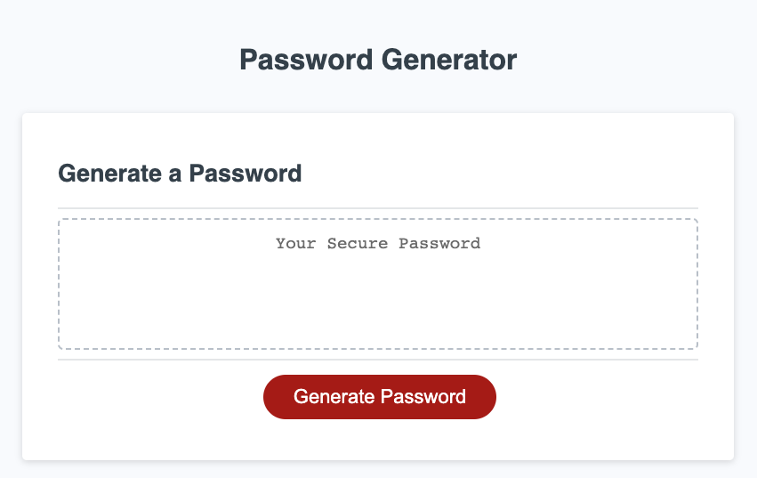

# Using JavaScript to Create a Password Generator

## Deployed Webpage 

Link to deployed web application: https://mackenzie-wentworth.github.io/password-generator/

## The Task

Given a starter code, I used JavaScript to create a password generator to ensure optimal security for employees who manage sensitive data. The password generator functions to populate a random password based on user input within the browser and is designed to respond to various screen sizes. To create the Password Generator, I made sure to include the following items:

* A series of prompts for users to answer which targets the password criteria necessary to generate a secure and randomized password
* Password criteria considers the length of the password chosen by the user, which must range between 8 to 128 characters
* Password criteria considers character types chosen by the user, selecting between options for lowercase, uppercase, numeric, and/or special characters
* Once the user has answered all password criteria prompts, then the random password is displayed to the webpage

## Mock-Up

The following image shows the appearance of the web application upon entering the Password Generator within a browser:

## Mock-Up

The following image displays the web application's homescreen appearance before a user starts the JavaScript Coding Quiz Challenge.

